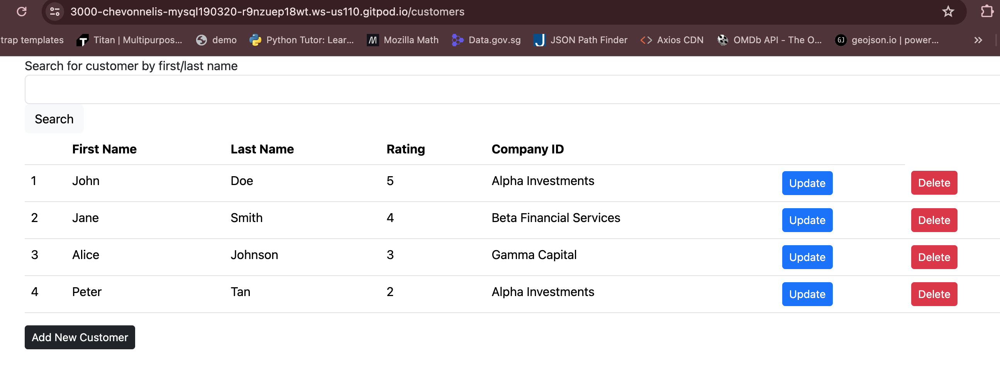
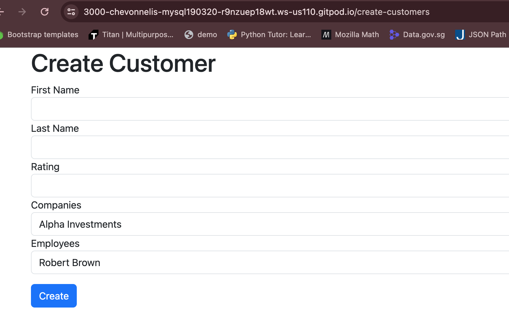

# About this project
This project is a MySQL database for a financial advisory company.

**Entity-Relationship Diagram (ERD)**

# Adding dataset to the database
1. Insert schema.sql data: in the terminal, type in `mysql -u root < dataset/schema.sql` 
2. Insert data.sql data: in the terminal, type in `mysql -u root < dataset/data.sql`

# Usage
**Check data in dataset**
1. To start mysql, in the terminal, type in `mysql -u root`
2. To change database, in the terminal, type in `use crm`
3. To show database, in the terminal, type in `show databases;`
4. To show tables, in the terminal, type in `show table;`

**Do CRUD in terminal**
1. To initialize, in the terminal, type in `npm init -y`
2. To run packages, in the terminal, type in `npm install`
3. To ensure that the CRUD is working, add a `.env` file.

4. To start server, in the terminal, type in `npm install -g nodemon` then `nodemon`

**Perform CRUD** 
Add in `/customers` to the end of the port URL. 
It should display this: 

***Create*** 
- To create a new customer, click on `Add New Customer` button.
- When redirected, add in customer's first name, last name, rating, company (that customer invested in), employee (that customer purchased investment from).

It should display this: 

***Read*** 
- The page rendered with the url ending with `/customers` will get the list of existing customers.
- To find a specific customer in the existing list, go to the searchbox and type in the customer's first name or last name.

***Update*** 
- The page rendered with the url ending with `/customers` will get the list of existing customers.
- To update the list of customers, click on `update` button for the specific customer to update that customer's details.
- When redirected, amend the customer's first name, last name, rating, company (that customer invested in), employee (that customer purchased investment from).

***Delete*** 
- The page rendered with the url ending with `/customers` will get the list of existing customers.
- To delete a customer, click on `delete` button for the specific customer to update that customer's details.
- When redirected, click on `confirm` if this is the customer you want to delete.

